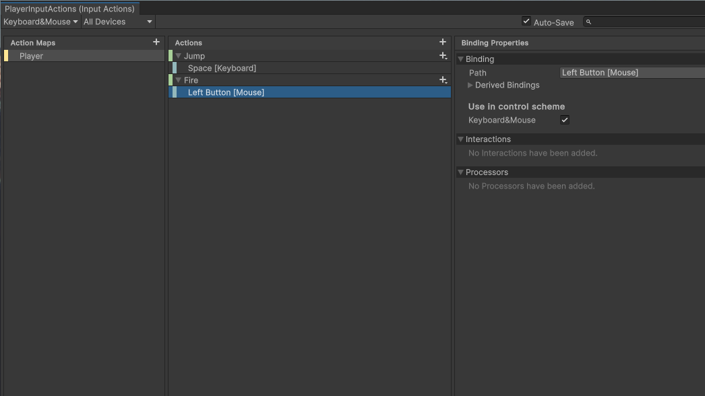

# Introduction

This walk-through is intended to get you up and running with Unity&rsquo;s event driven **Input System**. It is a brief summarization that does not get into the details behind it. For that go to [Input in Unity made easy](https://gamedevbeginner.com/input-in-unity-made-easy-complete-guide-to-the-new-system/), which is also the source that this demo is based on.
In this example we&rsquo;ll create **Input Actions** for a player. We&rsquo;ll create common actions that a player might create in a game.

# Installing the Input System

In the editors top menu bar, Navigate to *(Window > Package Manager)*

To install the input system:

1.  Select the *&ldquo;Unity Registry&rdquo;*
2.  Search for the *&ldquo;Input System&rdquo;*
3.  Select *&ldquo;Install&rdquo;*

Unity will proceed to install the **Input System** Package. You should now restart your Unity Editor.

# Creating Input Actions

**Input Actions** represent events that take place in your game. These events are triggered from some input like a keyboard, mouse or gamepad.

## Create a New Input Action Asset

An **Input Action Asset** represents a collection of **Action Maps**. This makes working with **Action Maps** more intuitive from the editor.
In the editors top menu bar, Navigate to *(Assets > Create > Input Actions)*

In our example we name this **Input Action Asset** *&ldquo;PlayerInputActions&rdquo;*.

## Configure Control Scheme

**Control Schemes** represent the input devices that will trigger our **Input Actions**.
Double clicking the **Input Action Asset** we just created in the editor, opens a new window.

1.  Select the *&ldquo;No Control Schemes&rdquo;* drop down menu
2.  Select *&ldquo;Add Control Scheme&#x2026;&rdquo;*

In our example we create a new scheme called *&ldquo;Keyboard&Mouse&rdquo;*. We attach the *&ldquo;[Keyboard]&rdquo;* and *&ldquo;[Mouse]&rdquo;* devices to this scheme.

1.  Click the plus button under the *&ldquo;List is Empty&rdquo;* UI.
2.  Search for the *&ldquo;[Keyboard]&rdquo;* device inn the search bar
3.  Select the *&ldquo;[Keyboard]&rdquo;* devices in the search results
4.  Repeat these steps 1-3 for the *&ldquo;Mouse&rdquo;* device
5.  Select *&ldquo;Save&rdquo;*

Our new scheme will be selected automatically because it is our only scheme. Be sure to check the *&ldquo;Auto-Save&rdquo;* box to save the changes we make in the **Input Actions** editor.

## Create a New Action Map

We&rsquo;ll create a new **Action Map** for our player. This holds all the **Input Actions** related to our player.

1.  Select the *&ldquo;+&rdquo;* icon in the *&ldquo;Action Maps&rdquo;* panel

We name our new **Action Map** as *&ldquo;Player&rdquo;*.

## Create New Binding

Unity creates an **Input Action** for us called *&ldquo;New action&rdquo;//*. Rename this action *&ldquo;Jump&rdquo;*. We&rsquo;ll set this action to be triggered by the space bar. We do this by creation a new **Binding**.

1.  Under the *&ldquo;Jump&rdquo;* action select *&ldquo;<No Binding>&rdquo;*
2.  In the *&ldquo;Binding&rdquo;* panel select the drop down menu next to *&ldquo;Path&rdquo;*
3.  In the search bar search for space
4.  Select *&ldquo;Space [Keyboard]&rdquo;* in the search results
    
    We repeat these steps but for a new **Input Action** called *&ldquo;Fire&rdquo;//*. This time we search for *&ldquo;Left Button [Mouse]&rdquo;* in the *&ldquo;Path&rdquo;* drop down menu. Our Actions look like this after we are finished.
    
    /newline
    /newline

Our **Input Actions** are now complete. Next we learn how to listen for when our events are triggered.

# Using Input Actions

Every time the player presses their spacebar or clicks their left mouse button, our *&ldquo;Jump&rdquo;* and *&ldquo;Fire&rdquo;* **Input Actions** are triggered

## Add Player Input

We can listen for those events using the **Player Input** component. Create an empty game object in the project Hierarchy called *&ldquo;Player&rdquo;//*. Add the **Player Input** component in the inspector for this *&ldquo;Player&rdquo;* game object.
After adding the component:

1.  In the **Player Input** component panel, select the *&ldquo;Actions&rdquo;* radial button
2.  Select your the **Input Action Asset** we created earlier
3.  Select the **Control Scheme** we created earlier

Our player object is now linked to our **Input Actions**, *&ldquo;Jump&rdquo;* and *&ldquo;Fire&rdquo;*.

## Add Logic to Input Action

Now that our player object is aware of our **Input Action** events we can add logic to them via a script. Add a new script to the *&ldquo;Player&rdquo;* game object. In our example we name it *&ldquo;PlayerActions&rdquo;*.
Add the following code snippet to the *&ldquo;PlayerActions.cs&rdquo;* file.

    using UnityEngine;
    
    public class PlayerActions : MonoBehaviour
    {
        // when the player creates the Jump event
        public void OnJump()
        {
            // print this message to the console
            Debug.Log("The Player created our Jump InputAction");
        }
    
        // when the player creates the Fire event
        public void OnFire()
        {
            // print this message to the console
            Debug.Log("The Player created our Fire InputAction");
        }
    }

With this code added to the player object, we&rsquo;ve succeeded in writing custom logic that will come to define what our **Input Actions** do. Now when we play our game the message, *&ldquo;The Player created our Jump InputAction&rdquo;//*, is printed when the player presses the spacebar. Or it will print *&ldquo;The Player created our Fire InputAction&rdquo;*.

# Why it Matters

[Input in Unity made easy](https://gamedevbeginner.com/input-in-unity-made-easy-complete-guide-to-the-new-system/) makes great points on why it is worthwhile to do this setup. Something it doesn&rsquo;t touch on however is how **Input Actions** promote good code. Creating the *&ldquo;PlayerAction.cs&rdquo;* script demonstrates good compartmentalization of game logic. It pulls us away from putting all our logic into the *&ldquo;Update()&rdquo;* method. It encourages an exciting design pattern that simplifies the difficult process of making a game.

